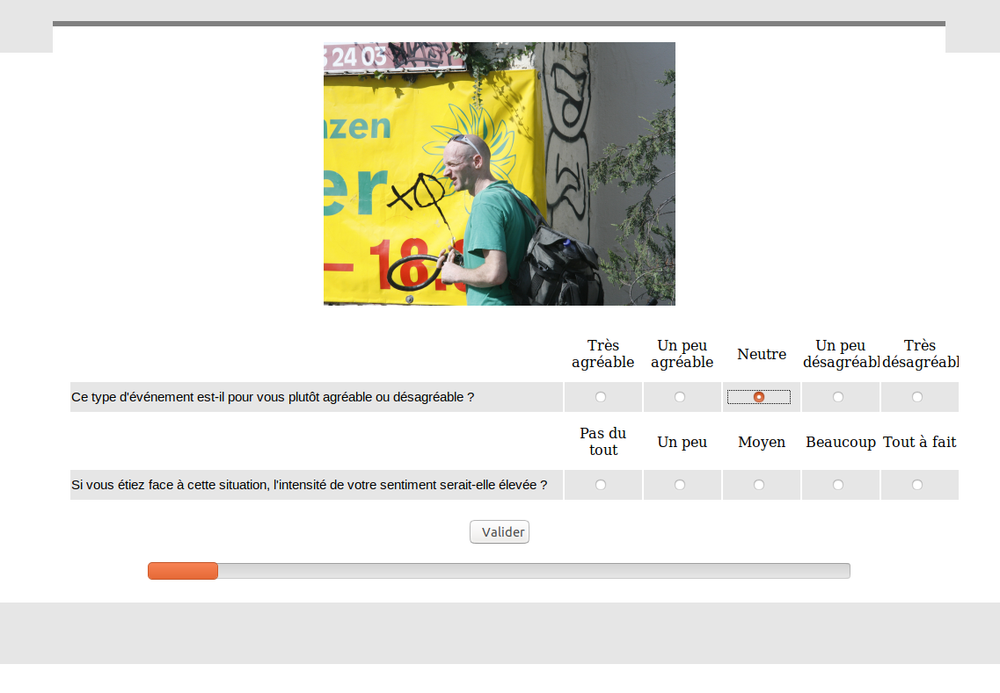

This repository provides files written in PHP and HTML to create a web survey for image rating.

Raters first have to enter personal identification (private code, gender, age) and then have to rate several images (examples in folder "images").
Rates are sent to a database on phpMyAdmin, which handles MySQL.

The original version is available [here](http://psy-cog-boj.alwaysdata.net/).



# Install

To upload files, a client such as FileZilla may be used.

To install on Debian :

```
sudo apt-get install filezilla
```

A phpMyAdmin database with two tables is required :

* answer, with the following columns :
- id_answer
- valence
- arousal
- date_time
- name_image
- id_participant

* participant, with the following columns :
- id_participant
- code
- age
- genre
